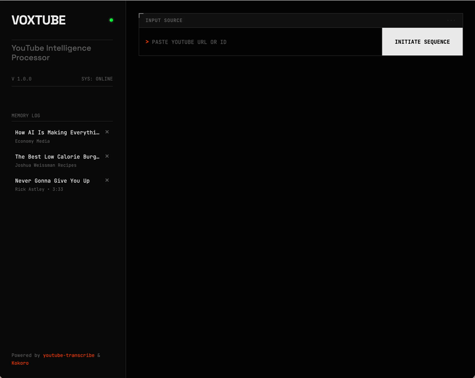

# 🎙️ VoxTube

[](https://github.com/shawn-dsz/voxtube)
[](https://opensource.org/licenses/MIT)
[](https://bun.sh)

**Convert YouTube videos to audio using high-quality text-to-speech.**

Don't want to watch a video? Listen to it instead.



VoxTube fetches the transcript from any YouTube video and converts it to audio using Kokoro TTS, letting you listen to video content like a podcast.

---

## Why VoxTube?

**The problem:** YouTube has amazing educational content—tutorials, conference talks, interviews. But video demands your eyes. You can't watch while commuting, cooking, or exercising.

**The solution:** VoxTube extracts the transcript and converts it to audio. Same content, zero screen time.

### Use Cases

| Situation | How VoxTube Helps |
|-----------|-------------------|
| 🚗 **Commuting** | Listen to tech talks and tutorials during your drive |
| 🍳 **Cooking** | Long-form interviews as kitchen companions |
| 🏃 **Exercise** | Educational content during workouts |
| 👁️ **Eye strain** | Screen-free consumption when you need a break |
| ⚡ **Speed listening** | Most audio players support 1.5x-2x playback |
| 📚 **Watch Later queue** | Finally work through that backlog |

---

## Features

- 📺 Paste any YouTube URL or video ID
- 🎤 Choose from multiple TTS voices
- 💾 Audio caching (avoids regenerating)
- 🗑️ Automatic cache cleanup (TTL-based)
- 🧠 Pluggable LLM summarization (Kimmy/Kimi API or Claude CLI)
- ⚡ Fast—built with Bun + Hono
- 🔒 Local-first runtime with optional cloud LLM API

---

## Prerequisites

1. **Bun** — [Install Bun](https://bun.sh)
   ```bash
   curl -fsSL https://bun.sh/install | bash
   ```

2. **YouTube Transcript CLI** — [youtube-transcribe](https://github.com/shawn-dsz/youtube-transcribe)
   ```bash
   git clone https://github.com/shawn-dsz/youtube-transcribe.git
   cd youtube-transcribe
   bun install
   bun link  # Makes 'yt' available globally
   ```

3. **Kokoro TTS** — [Kokoro-FastAPI](https://github.com/remsky/Kokoro-FastAPI)
   ```bash
   docker run -p 8880:8880 ghcr.io/remsky/kokoro-fastapi:latest
   ```

---

## Installation

```bash
# Clone this repo
git clone https://github.com/shawn-dsz/voxtube.git
cd voxtube

# Install dependencies
bun install

# Copy environment config
cp .env.example .env

# Edit .env if needed (defaults work for local setup)
```

---

## Configuration

Edit `.env` to customize:

```env
PORT=3000                         # Server port
KOKORO_URL=http://localhost:8880  # Kokoro TTS server
CACHE_DIR=./cache                 # Where to store generated audio
CACHE_TTL_DAYS=7                  # How long to keep cached audio
YT_CLI_PATH=yt                    # Path to youtube-transcribe CLI
LLM_PROVIDER=openai_compat        # openai_compat or claude_cli
LLM_API_KEY=...                   # Required for openai_compat
LLM_BASE_URL=https://api.moonshot.ai/v1
LLM_MODEL=moonshot-v1-8k
LLM_TIMEOUT_MS=120000             # LLM request timeout (ms)
CLAUDE_CLI_PATH=claude            # Used only when LLM_PROVIDER=claude_cli
```

---

## Usage

```bash
# Start the server
bun run start

# Or with hot reload for development
bun run dev
```

Open http://localhost:3000 in your browser.

1. Paste a YouTube URL (e.g., `https://youtube.com/watch?v=dQw4w9WgXcQ`)
2. Click "Get Transcript"
3. Select a voice from the dropdown
4. Click "Generate Audio"
5. Listen! 🎧

---

## API Endpoints

| Endpoint | Method | Description |
|----------|--------|-------------|
| `/api/health` | GET | Health check with cache stats |
| `/api/voices` | GET | List available TTS voices |
| `/api/transcript` | POST | Fetch YouTube transcript |
| `/api/summarize` | POST | Summarize transcript via configured LLM provider |
| `/api/synthesize` | POST | Generate TTS audio |
| `/api/history` | GET | List previously generated audio |
| `/api/history/:videoId` | DELETE | Remove cached audio |

### Example: Fetch Transcript

```bash
curl -X POST http://localhost:3000/api/transcript \
  -H "Content-Type: application/json" \
  -d '{"url": "https://youtube.com/watch?v=dQw4w9WgXcQ"}'
```

### Example: Generate Audio

```bash
curl -X POST http://localhost:3000/api/synthesize \
  -H "Content-Type: application/json" \
  -d '{"videoId": "dQw4w9WgXcQ", "text": "Hello world", "voice": "af_sky"}' \
  --output audio.mp3
```

---

## Tech Stack

- **Runtime**: [Bun](https://bun.sh) — Fast JavaScript runtime
- **Framework**: [Hono](https://hono.dev) — Lightweight web framework
- **TTS**: [Kokoro](https://github.com/remsky/Kokoro-FastAPI) — High-quality local TTS
- **Transcripts**: [youtube-transcribe](https://github.com/shawn-dsz/youtube-transcribe)

---

## Contributing

Contributions welcome! See [CONTRIBUTING.md](CONTRIBUTING.md) for guidelines.

Ideas for contributions:
- Voice preview before generating
- Playlist support
- Chapter markers for long videos
- Progress indicators during generation
- Browser extension

---

## Star History

[](https://star-history.com/#shawn-dsz/voxtube&Date)

---

## License

MIT
