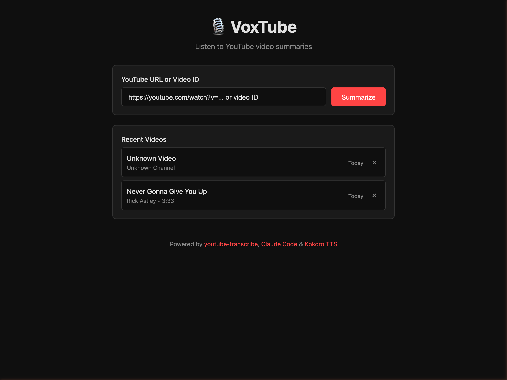

# 🎙️ VoxTube

Convert YouTube videos to audio using high-quality text-to-speech.

**Don't want to watch a video? Listen to it instead.**



VoxTube fetches the transcript from any YouTube video and converts it to audio using Kokoro TTS, letting you listen to video content like a podcast.

## Features

- 📺 Paste any YouTube URL or video ID
- 🎤 Choose from multiple TTS voices
- 💾 Audio caching (avoids regenerating)
- 🗑️ Automatic cache cleanup (TTL-based)
- ⚡ Fast - built with Bun + Hono

## Prerequisites

1. **Bun** - [Install Bun](https://bun.sh)
   ```bash
   curl -fsSL https://bun.sh/install | bash
   ```

2. **YouTube Transcript CLI** - [youtube-transcribe](https://github.com/shawn-dsz/youtube-transcribe)
   ```bash
   # Clone and install
   git clone https://github.com/shawn-dsz/youtube-transcribe.git
   cd youtube-transcribe
   bun install
   bun link  # Makes 'yt' available globally
   ```

3. **Kokoro TTS** - [Kokoro-FastAPI](https://github.com/remsky/Kokoro-FastAPI)
   ```bash
   # Run with Docker
   docker run -p 8880:8880 ghcr.io/remsky/kokoro-fastapi:latest
   ```

## Installation

```bash
# Clone this repo
git clone https://github.com/shawn-dsz/voxtube.git
cd voxtube

# Install dependencies
bun install

# Copy environment config
cp .env.example .env

# Edit .env if needed (defaults work for local setup)
```

## Configuration

Edit `.env` to customize:

```env
PORT=3000                    # Server port
KOKORO_URL=http://localhost:8880  # Kokoro TTS server
CACHE_DIR=./cache            # Where to store generated audio
CACHE_TTL_DAYS=7             # How long to keep cached audio
YT_CLI_PATH=yt               # Path to youtube-transcribe CLI
```

## Usage

```bash
# Start the server
bun run start

# Or with hot reload for development
bun run dev
```

Open http://localhost:3000 in your browser.

1. Paste a YouTube URL (e.g., `https://youtube.com/watch?v=dQw4w9WgXcQ`)
2. Click "Get Transcript"
3. Select a voice from the dropdown
4. Click "Generate Audio"
5. Listen! 🎧

## API Endpoints

| Endpoint | Method | Description |
|----------|--------|-------------|
| `/api/health` | GET | Health check with cache stats |
| `/api/voices` | GET | List available TTS voices |
| `/api/transcript` | POST | Fetch YouTube transcript |
| `/api/synthesize` | POST | Generate TTS audio |

### Example: Fetch Transcript

```bash
curl -X POST http://localhost:3000/api/transcript \
  -H "Content-Type: application/json" \
  -d '{"url": "https://youtube.com/watch?v=dQw4w9WgXcQ"}'
```

### Example: Generate Audio

```bash
curl -X POST http://localhost:3000/api/synthesize \
  -H "Content-Type: application/json" \
  -d '{"videoId": "dQw4w9WgXcQ", "text": "Hello world", "voice": "af_sky"}' \
  --output audio.mp3
```

## Tech Stack

- **Runtime**: [Bun](https://bun.sh) - Fast JavaScript runtime
- **Framework**: [Hono](https://hono.dev) - Lightweight web framework
- **TTS**: [Kokoro](https://github.com/remsky/Kokoro-FastAPI) - High-quality TTS
- **Transcripts**: [youtube-transcribe](https://github.com/shawn-dsz/youtube-transcribe)

## License

MIT
